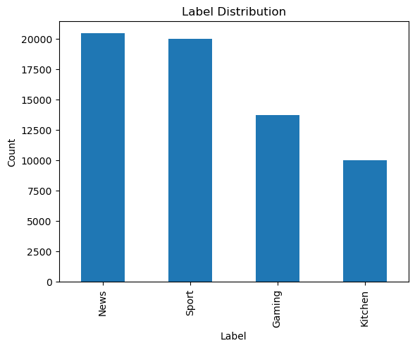
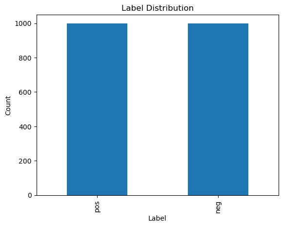
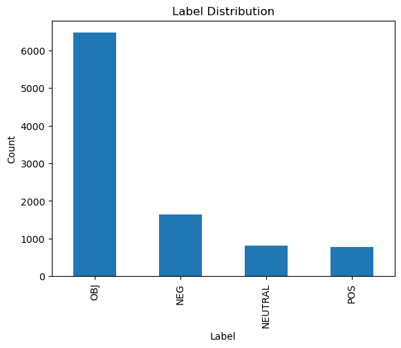
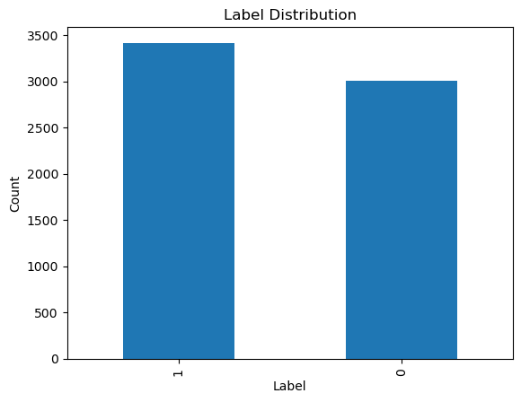
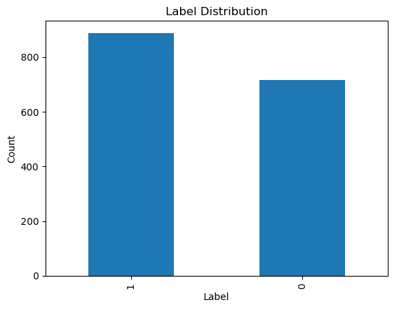
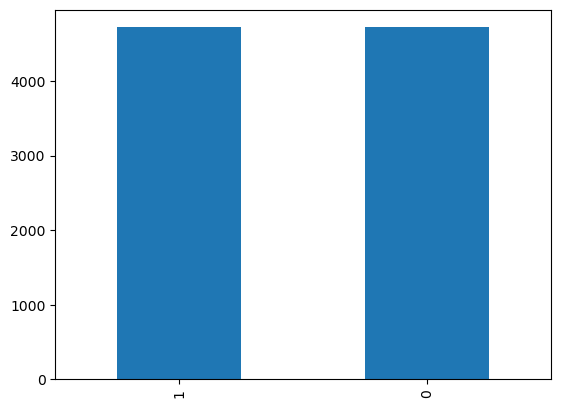
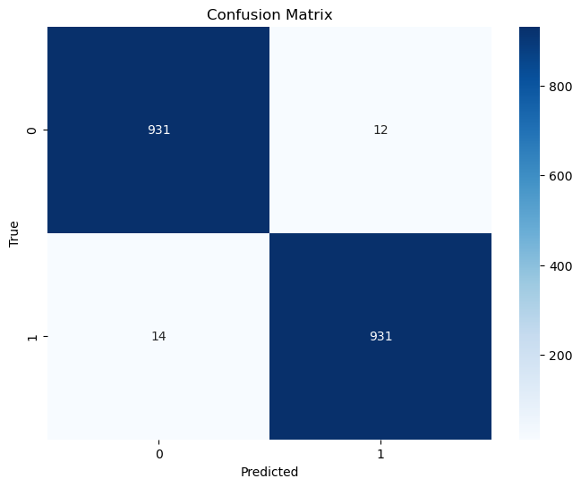

```python
import pandas as pd 
import seaborn as sns
import matplotlib.pyplot as plt
```

# Exploration des Données 

### df1 - Commentaires Facebook
- Source : Commentaires d'une source spécifique sur Facebook.
- Format : Texte brut de commentaires.

### df2 - Tweets Marocains
- Source : Tweets liés à des hashtags au Maroc.
- Format : Texte brut de tweets.

### df3 - Commentaires sur les Actualités
- Source : Commentaires sur les actualités marocaines provenant de sites comme hespress.ma sur Facebook.
- Format : Texte brut de commentaires.
### df4 - Commentaires sur YouTube
- Source : Commentaires marocains sur des vidéos sur YouTube.
- Format : Texte brut de commentaires.


```python
# datasets des categories 
df=pd.read_csv('MTCD.csv')
# data collectes des socials medias 
df1 = pd.read_csv('Dataset/data1.csv')
df2 = pd.read_csv('Dataset/data2.txt', sep='\t', header=None, names=['text', 'label'])
df3 = pd.read_csv('Dataset/data3.csv')
df4 = pd.read_csv('Dataset/data4.csv')


```


```python
df.head()
```


<div>
<style scoped>
    .dataframe tbody tr th:only-of-type {
        vertical-align: middle;
    }

    .dataframe tbody tr th {
        vertical-align: top;
    }

    .dataframe thead th {
        text-align: right;
    }
</style>
<table border="1" class="dataframe">
  <thead>
    <tr style="text-align: right;">
      <th></th>
      <th>text</th>
      <th>labels</th>
    </tr>
  </thead>
  <tbody>
    <tr>
      <th>0</th>
      <td>خويا نصيحة مني. كمل فخدمتك ومتديهاش فكلام ناس ...</td>
      <td>News</td>
    </tr>
    <tr>
      <th>1</th>
      <td>ضربناكم كاملين ١😂🖕🇲🇦🇲🇦🇲🇦🇲🇦</td>
      <td>Sport</td>
    </tr>
    <tr>
      <th>2</th>
      <td>بغيت نشارك فشي مسابقة حيت عندي 90 فتخفيض</td>
      <td>Gaming</td>
    </tr>
    <tr>
      <th>3</th>
      <td>چاتني 92ف10</td>
      <td>Gaming</td>
    </tr>
    <tr>
      <th>4</th>
      <td>USER angel  \nجواب العياشة هوا لي كلتي دابا</td>
      <td>News</td>
    </tr>
  </tbody>
</table>
</div>


```python
df.isnull()
```


<div>
<style scoped>
    .dataframe tbody tr th:only-of-type {
        vertical-align: middle;
    }

    .dataframe tbody tr th {
        vertical-align: top;
    }

    .dataframe thead th {
        text-align: right;
    }
</style>
<table border="1" class="dataframe">
  <thead>
    <tr style="text-align: right;">
      <th></th>
      <th>text</th>
      <th>labels</th>
    </tr>
  </thead>
  <tbody>
    <tr>
      <th>0</th>
      <td>False</td>
      <td>False</td>
    </tr>
    <tr>
      <th>1</th>
      <td>False</td>
      <td>False</td>
    </tr>
    <tr>
      <th>2</th>
      <td>False</td>
      <td>False</td>
    </tr>
    <tr>
      <th>3</th>
      <td>False</td>
      <td>False</td>
    </tr>
    <tr>
      <th>4</th>
      <td>False</td>
      <td>False</td>
    </tr>
    <tr>
      <th>...</th>
      <td>...</td>
      <td>...</td>
    </tr>
    <tr>
      <th>64217</th>
      <td>False</td>
      <td>False</td>
    </tr>
    <tr>
      <th>64218</th>
      <td>False</td>
      <td>False</td>
    </tr>
    <tr>
      <th>64219</th>
      <td>False</td>
      <td>False</td>
    </tr>
    <tr>
      <th>64220</th>
      <td>False</td>
      <td>False</td>
    </tr>
    <tr>
      <th>64221</th>
      <td>False</td>
      <td>False</td>
    </tr>
  </tbody>
</table>
<p>64222 rows × 2 columns</p>
</div>


```python
#df['labels'].value_counts()
df['labels'].value_counts().plot(kind='bar')
plt.title('Label Distribution')
plt.xlabel('Label')
plt.ylabel('Count')
plt.show()
```


    

    


```python
sns.heatmap(df.isnull())
```


    <Axes: >


    

    


```python
# raport de datasets pour les autres 
def rapport_dataset(df,label='label'):
    conclusions=[]
    conclusions.append(df.describe())
    df[label].value_counts().plot(kind='bar')
    plt.title('Label Distribution')
    plt.xlabel('Label')
    plt.ylabel('Count')
    plt.show()

    if(df.isnull().sum().sum()==0):
        conclusions.append("pas de valeur null")
    else :
        conclusions.append("valeur null est : "+str(df.isnull().sum().sum()))
    return conclusions

```


```python
#premier dataset 
df1.head()
```


<div>
<style scoped>
    .dataframe tbody tr th:only-of-type {
        vertical-align: middle;
    }

    .dataframe tbody tr th {
        vertical-align: top;
    }

    .dataframe thead th {
        text-align: right;
    }
</style>
<table border="1" class="dataframe">
  <thead>
    <tr style="text-align: right;">
      <th></th>
      <th>tweet</th>
      <th>label</th>
    </tr>
  </thead>
  <tbody>
    <tr>
      <th>0</th>
      <td>طوال حياتي لم المس اي تغير حتى قدمت هذه الحكوم...</td>
      <td>pos</td>
    </tr>
    <tr>
      <th>1</th>
      <td>منتوج رائع  وثمن مناسب ....جميل</td>
      <td>pos</td>
    </tr>
    <tr>
      <th>2</th>
      <td>كلنا ابن كيران لمتافق معايا يدير جيم</td>
      <td>pos</td>
    </tr>
    <tr>
      <th>3</th>
      <td>وفقك الله لولاية اخرى حقاش مكينش محسن منك</td>
      <td>pos</td>
    </tr>
    <tr>
      <th>4</th>
      <td>لأنه و بكل بساطة رئيس الحكومة يعتني بمعاق داخل...</td>
      <td>pos</td>
    </tr>
  </tbody>
</table>
</div>


```python
rapport_dataset(df1)
```


    

    


    [                                          tweet label
     count                                      2000  2000
     unique                                     1975     2
     top     وكنفتخر بكل رجال ونساء العدالة والتنمية   pos
     freq                                          2  1000,
     'pas de valeur null']


```python
# datasets 2 
df2.head(30)
```


<div>
<style scoped>
    .dataframe tbody tr th:only-of-type {
        vertical-align: middle;
    }

    .dataframe tbody tr th {
        vertical-align: top;
    }

    .dataframe thead th {
        text-align: right;
    }
</style>
<table border="1" class="dataframe">
  <thead>
    <tr style="text-align: right;">
      <th></th>
      <th>text</th>
      <th>label</th>
    </tr>
  </thead>
  <tbody>
    <tr>
      <th>0</th>
      <td>البرادعي يستقوى بامريكا مرةاخرى و يرسل عصام ال...</td>
      <td>0</td>
    </tr>
    <tr>
      <th>1</th>
      <td>عودة جماعة الإخوان إلى الحياة السياسية بنفس وض...</td>
      <td>0</td>
    </tr>
    <tr>
      <th>2</th>
      <td>الإصرار علي الإستفتاء في ظل وطن ممزق وغليان شع...</td>
      <td>0</td>
    </tr>
    <tr>
      <th>3</th>
      <td>أدين بشدة تقديم كل صاحب رأي أو ناشط سياسي للمح...</td>
      <td>0</td>
    </tr>
    <tr>
      <th>4</th>
      <td>1 العنف مدان، ضد منشآت عامة أو خاصة، ضد مجمع م...</td>
      <td>0</td>
    </tr>
    <tr>
      <th>5</th>
      <td>انا لو نفسي اخطط و ارتب و اصرف فلوس الدنيا عشا...</td>
      <td>0</td>
    </tr>
    <tr>
      <th>6</th>
      <td>تحالف بين #أنصار_بيت_المقدس و #الحرس_الثوري لت...</td>
      <td>0</td>
    </tr>
    <tr>
      <th>7</th>
      <td>_ 0 مش عيب تكذب؟ عمري ما عملت ولا هعمل بلوك لح...</td>
      <td>0</td>
    </tr>
    <tr>
      <th>8</th>
      <td>الضعف الانتخابي والجماهيري لا يقتصر على الأحزا...</td>
      <td>0</td>
    </tr>
    <tr>
      <th>9</th>
      <td>#مصر_القوية |11-حذرنا من خطر تحول سلطات الدولة...</td>
      <td>0</td>
    </tr>
    <tr>
      <th>10</th>
      <td>منذ عامين وحتى الآن كل ما قدمه أنصار تيارات ال...</td>
      <td>0</td>
    </tr>
    <tr>
      <th>11</th>
      <td>#باسم_طلع_حرامى يا حرامي</td>
      <td>0</td>
    </tr>
    <tr>
      <th>12</th>
      <td>السلفي سعيد عبد العظيم قال أن مرسي آية من آيات...</td>
      <td>0</td>
    </tr>
    <tr>
      <th>13</th>
      <td>اكثر شعور يوجع ! ^#لما تجوع في بيت مو بيتكم ☺**</td>
      <td>0</td>
    </tr>
    <tr>
      <th>14</th>
      <td>5 هاتلي اخوان أي حاجة مش تنوين ومش ضمير اخوان ...</td>
      <td>0</td>
    </tr>
    <tr>
      <th>15</th>
      <td>الماظة:لابد من معايرة العدادات وتوحيد التعريفة...</td>
      <td>0</td>
    </tr>
    <tr>
      <th>16</th>
      <td>‏ الأسواني:ماذا فعلوا الأخوان رداًعلى سحل فتاة...</td>
      <td>0</td>
    </tr>
    <tr>
      <th>17</th>
      <td>حرية التعبير لا تتضمن التحريض على العنف و الفت...</td>
      <td>0</td>
    </tr>
    <tr>
      <th>18</th>
      <td>قصدي كان موجه لكذبك أني ما كنتش هناك</td>
      <td>0</td>
    </tr>
    <tr>
      <th>19</th>
      <td>مرسي فتح على نفسه فتوحة ضنك بذاته الرئاسية دي ...</td>
      <td>0</td>
    </tr>
    <tr>
      <th>20</th>
      <td>بكري قبل مايستقيل خد معاه الميكروفون البيتبكري...</td>
      <td>0</td>
    </tr>
    <tr>
      <th>21</th>
      <td>ويبقى دائما السؤال: لما إنت جامد قوي ومفترض إن...</td>
      <td>0</td>
    </tr>
    <tr>
      <th>22</th>
      <td>5ج وأنعت الرئيس بعد الحشد المذهبي والطائفي برئ...</td>
      <td>0</td>
    </tr>
    <tr>
      <th>23</th>
      <td>إستمرار الحراك الطلابي بـ #جامعة_المنصورة #مفي...</td>
      <td>0</td>
    </tr>
    <tr>
      <th>24</th>
      <td>7_ أكبر معوقة وخازوق أخذناه كان من الإخوان أنا...</td>
      <td>0</td>
    </tr>
    <tr>
      <th>25</th>
      <td>الراجل بتاع الامن بينف بمعدل نفتين كل ٧ دقايق ...</td>
      <td>0</td>
    </tr>
    <tr>
      <th>26</th>
      <td>حظ العوالم ! :) #الاهلي_الافريقي</td>
      <td>0</td>
    </tr>
    <tr>
      <th>27</th>
      <td>منهج الانقلاب قتل وقمع وسجن اى معارض اعلام فاس...</td>
      <td>0</td>
    </tr>
    <tr>
      <th>28</th>
      <td>1 3 قتلى وأكثر من 450 مصاب في محافظات مختلفة، ...</td>
      <td>0</td>
    </tr>
    <tr>
      <th>29</th>
      <td>نفسي فيه و تفوو عليه ! #فيفي_عبده =))</td>
      <td>0</td>
    </tr>
  </tbody>
</table>
</div>


```python
rapport_dataset(df2)
```


    

    


    [                                                     text label
     count                                                9694  9694
     unique                                               9690     4
     top     الإخوان يطلقون طفايات الحريق للإيحاء بإلقاء ال...   OBJ
     freq                                                    2  6470,
     'pas de valeur null']


```python
#df3
df3.head()
```


<div>
<style scoped>
    .dataframe tbody tr th:only-of-type {
        vertical-align: middle;
    }

    .dataframe tbody tr th {
        vertical-align: top;
    }

    .dataframe thead th {
        text-align: right;
    }
</style>
<table border="1" class="dataframe">
  <thead>
    <tr style="text-align: right;">
      <th></th>
      <th>Unnamed: 0</th>
      <th>comment</th>
      <th>off</th>
    </tr>
  </thead>
  <tbody>
    <tr>
      <th>0</th>
      <td>2908</td>
      <td>فنانين الكبت والفساد .عقلية جنسية لا غير. العف...</td>
      <td>1</td>
    </tr>
    <tr>
      <th>1</th>
      <td>1055</td>
      <td>الدعارة هربت منها في المحمدية و سكنت في بوزنيق...</td>
      <td>1</td>
    </tr>
    <tr>
      <th>2</th>
      <td>181</td>
      <td>كون غير خريتي و مدرتيش هادشي</td>
      <td>1</td>
    </tr>
    <tr>
      <th>3</th>
      <td>4313</td>
      <td>لا حول ولا قوة الا بالله العلي العظيم لا حول و...</td>
      <td>0</td>
    </tr>
    <tr>
      <th>4</th>
      <td>228</td>
      <td>الله يرحم الوالدين عندي مشكل كبيييير و محتاجة ...</td>
      <td>0</td>
    </tr>
  </tbody>
</table>
</div>


```python
rapport_dataset(df3,"off")
```


    

    


    [        Unnamed: 0          off
     count  6419.000000  6419.000000
     mean   3994.863842     0.532170
     std    2304.167917     0.499003
     min       0.000000     0.000000
     25%    2000.000000     0.000000
     50%    3980.000000     1.000000
     75%    5979.500000     1.000000
     max    8022.000000     1.000000,
     'pas de valeur null']


```python
# dataset 4
df4.head()
```


<div>
<style scoped>
    .dataframe tbody tr th:only-of-type {
        vertical-align: middle;
    }

    .dataframe tbody tr th {
        vertical-align: top;
    }

    .dataframe thead th {
        text-align: right;
    }
</style>
<table border="1" class="dataframe">
  <thead>
    <tr style="text-align: right;">
      <th></th>
      <th>Unnamed: 0</th>
      <th>comment</th>
      <th>off</th>
    </tr>
  </thead>
  <tbody>
    <tr>
      <th>0</th>
      <td>6139</td>
      <td>تبهديل تسؤلو البنات في الشارع</td>
      <td>1</td>
    </tr>
    <tr>
      <th>1</th>
      <td>3447</td>
      <td>انا مستعد بي مسعدة بسيطة في وجه اللة ربي يادير...</td>
      <td>0</td>
    </tr>
    <tr>
      <th>2</th>
      <td>6844</td>
      <td>لاحول ولاقوة الا بالله العلي العظيم</td>
      <td>0</td>
    </tr>
    <tr>
      <th>3</th>
      <td>2512</td>
      <td>حتى هاد العائلة لي جالس وسط منهوم خص يدلمهوم ا...</td>
      <td>1</td>
    </tr>
    <tr>
      <th>4</th>
      <td>2000</td>
      <td>لا حول ولا قوة الا بالله اش هذا المستوى اصلا ر...</td>
      <td>1</td>
    </tr>
  </tbody>
</table>
</div>


```python
rapport_dataset(df4,"off")
```


    

    


    [        Unnamed: 0          off
     count  1605.000000  1605.000000
     mean   4078.034268     0.553271
     std    2364.607793     0.497309
     min      10.000000     0.000000
     25%    2031.000000     0.000000
     50%    4140.000000     1.000000
     75%    6139.000000     1.000000
     max    8023.000000     1.000000,
     'pas de valeur null']


## Conclusions sur les datasets

Nous avons examiné quatre ensembles de données liés aux sentiments, et voici nos observations pour chaque ensemble :

### df1
- Le dataset est équilibré avec 1000 commentaires positifs et 1000 commentaires négatifs.
- Cependant, il est nécessaire de transformer les valeurs pour qu'elles soient binaires (1, 0).

### df2
- Le dataset présente un déséquilibre entre les classes.
- Les données ne sont pas encore binaires, nécessitant une équilibrage des données.
- Il est nécessaire de supprimer les données associées à des classes autres que positives et négatives.
- Codification des sentiments en 1 pour positif et 0 pour négatif.

### df3
- Les commentaires dans cet ensemble de données sont proches de l'équilibre.
- Une équilibrage est nécessaire pour chaque classe.

### df4
- Équilibrage des données requis.
- Renommer les classes en utilisant une codification binaire.

### Remarque générale
- L'équilibrage des données est crucial dans tous les ensembles.
- Pour les datasets non binaires, la transformation en binaire (1, 0) est nécessaire.
- Il est également recommandé de normaliser les valeurs de la moyenne des données binaires à 0,5 pour df4.


# Prétraitement des Données

1. Transformer les valeurs du dataset df1 en binaires (1, 0).
2. Équilibrer les classes dans df2, df3 et df4.
3. Supprimer les données associées à des classes autres que positives et négatives dans df2.
4. Renommer les classes de df4 en utilisant une codification binaire.
5. creation d'un dataframe de tout les donnes 


```python
#fonction pour equilibre les donnes 
import pandas as pd

def equilibrer_dataframe(df, cible, methode, graine_aleatoire=42):

    # Trouver la classe avec le nombre minimum / maximum d'échantillons
    classe_minoritaire = df[cible].value_counts().idxmin()
    classe_majoritaire = df[cible].value_counts().idxmax()

    # Séparer le DataFrame en deux en fonction de la classe cible
    df_minoritaire = df[df[cible] == classe_minoritaire]
    df_majoritaire = df[df[cible] == classe_majoritaire]

    if methode == 'over' or methode == 1:
        # Duplication aléatoire des lignes
        facteur_surechantillonnage = int(len(df_majoritaire) / len(df_minoritaire))
        df_minoritaire_resample = pd.concat([df_minoritaire] * facteur_surechantillonnage, ignore_index=True)
        df_equilibre = pd.concat([df_majoritaire, df_minoritaire_resample], ignore_index=True)
    elif methode == 'under' or methode == -1:
        # Suppression aléatoire des lignes
        taille_sous_echantillon = min(len(df_minoritaire), len(df_majoritaire))
        df_majoritaire_sous_echantillonne = df_majoritaire.sample(n=taille_sous_echantillon, random_state=graine_aleatoire)
        df_equilibre = pd.concat([df_majoritaire_sous_echantillonne, df_minoritaire], ignore_index=True)
    else:
        raise ValueError("Méthode d'équilibrage invalide. Utilisez 'over/1' ou 'under/-1'")

    return df_equilibre

```


```python
# Transformer les valeurs du dataset df1 en binaires (1, 0)
df1['label'] = df1['label'].map({'pos': 1, 'neg': 0})

# Supprimer les données associées à des classes autres que positives et négatives dans df2
df2 = df2[df2['label'].isin(['POS', 'NEG'])]

# Transformer les valeurs du dataset df en binaires (1, 0)
df2['label'] = df2['label'].map({'POS': 1, 'NEG': 0})


# Renommer le champ "off" dans df3
df3 = df3.rename(columns={'off': 'label'})
# Renommer le champ "off" dans df4
df4 = df4.rename(columns={'off': 'label'})

# Renommer le champ "text" dans les dfs
df1 = df1.rename(columns={'tweet': 'text'})
df3 = df3.rename(columns={'comment': 'text'})
df4 = df4.rename(columns={'comment': 'text'})

# equilbre des donnes 

df2 = equilibrer_dataframe(df2, 'label', 1)
df3 = equilibrer_dataframe(df3, 'label', -1)
df4 = equilibrer_dataframe(df4, 'label', -1)


# Afficher les aperçus des données après le prétraitement
print("df1 après transformation binaire :\n", df1['label'].value_counts())
print("\ndf2 après équilibrage et suppression :\n", df2['label'].value_counts())
print("\ndf3 après équilibrage :\n", df3['label'].value_counts())
print("\ndf4 après renommage binaire :\n", df4['label'].value_counts())
```

    df1 après transformation binaire :
     1    1000
    0    1000
    Name: label, dtype: int64
    
    df2 après équilibrage et suppression :
     0    1642
    1    1554
    Name: label, dtype: int64
    
    df3 après équilibrage :
     1    3003
    0    3003
    Name: label, dtype: int64
    
    df4 après renommage binaire :
     1    717
    0    717
    Name: label, dtype: int64
    


```python
def merge_dataframes(dfs):
    """
    Balence the dataframe by [under-sampling the majority/oversampling the minority] class

    Parameters:
    - dfs: List of Pandas DataFrames to merge

    Returns:
    - Merged Pandas DataFrame
    """

    merged_df = pd.concat(dfs, ignore_index=True)
 #   merged_df = merged_df.drop_duplicates()

    return merged_df
```


```python
df= merge_dataframes([df1,df3,df4])
df = df.drop('Unnamed: 0', axis=1)

```


```python
df.isnull().sum().sum()
```


    0


```python
df["label"].value_counts()
```


    1    4720
    0    4720
    Name: label, dtype: int64


```python
df.head()
```


<div>
<style scoped>
    .dataframe tbody tr th:only-of-type {
        vertical-align: middle;
    }

    .dataframe tbody tr th {
        vertical-align: top;
    }

    .dataframe thead th {
        text-align: right;
    }
</style>
<table border="1" class="dataframe">
  <thead>
    <tr style="text-align: right;">
      <th></th>
      <th>text</th>
      <th>label</th>
      <th>cleaned_text</th>
    </tr>
  </thead>
  <tbody>
    <tr>
      <th>0</th>
      <td>طوال حياتي لم المس اي تغير حتى قدمت هذه الحكوم...</td>
      <td>1</td>
      <td>طوال حياتي لم المس اي تغير حتى قدمت هذه الحكوم...</td>
    </tr>
    <tr>
      <th>1</th>
      <td>منتوج رائع  وثمن مناسب ....جميل</td>
      <td>1</td>
      <td>منتوج رائع وثمن مناسب جميل</td>
    </tr>
    <tr>
      <th>2</th>
      <td>كلنا ابن كيران لمتافق معايا يدير جيم</td>
      <td>1</td>
      <td>كلنا ابن كيران لمتافق معايا يدير جيم</td>
    </tr>
    <tr>
      <th>3</th>
      <td>وفقك الله لولاية اخرى حقاش مكينش محسن منك</td>
      <td>1</td>
      <td>وفقك اله لولاية اخرى حقاش مكينش محسن منك</td>
    </tr>
    <tr>
      <th>4</th>
      <td>لأنه و بكل بساطة رئيس الحكومة يعتني بمعاق داخل...</td>
      <td>1</td>
      <td>لأنه و بكل بساطة رئيس الحكومة يعتني بمعاق داخل...</td>
    </tr>
  </tbody>
</table>
</div>


```python
#enregister les donnes 
df.to_csv('dataMerge.csv', encoding='utf-8', index=False)
```

# traitement de text et Tokenization


```python
import nltk
nltk.download('punkt')
from nltk.tokenize import word_tokenize
from nltk.corpus import stopwords

# Download nltk resources
nltk.download('stopwords')
import re
from nltk.stem import SnowballStemmer


```

    [nltk_data] Downloading package punkt to
    [nltk_data]     C:\Users\sejja\AppData\Roaming\nltk_data...
    [nltk_data]   Package punkt is already up-to-date!
    [nltk_data] Downloading package stopwords to
    [nltk_data]     C:\Users\sejja\AppData\Roaming\nltk_data...
    [nltk_data]   Package stopwords is already up-to-date!
    


```python
emodf = pd.read_csv('Dataset/emojis.csv')

emodf.head()
```


<div>
<style scoped>
    .dataframe tbody tr th:only-of-type {
        vertical-align: middle;
    }

    .dataframe tbody tr th {
        vertical-align: top;
    }

    .dataframe thead th {
        text-align: right;
    }
</style>
<table border="1" class="dataframe">
  <thead>
    <tr style="text-align: right;">
      <th></th>
      <th>emoji</th>
      <th>text</th>
    </tr>
  </thead>
  <tbody>
    <tr>
      <th>0</th>
      <td>🎃</td>
      <td>جاك فانوس</td>
    </tr>
    <tr>
      <th>1</th>
      <td>🎄</td>
      <td>شجرة عيد الميلاد</td>
    </tr>
    <tr>
      <th>2</th>
      <td>🎆</td>
      <td>العاب ناريه</td>
    </tr>
    <tr>
      <th>3</th>
      <td>🎇</td>
      <td>الماسة</td>
    </tr>
    <tr>
      <th>4</th>
      <td>🧨</td>
      <td>مفرقعة نارية</td>
    </tr>
  </tbody>
</table>
</div>


```python
def create_emoji_mapping(df):
    """
    Create a mapping dictionary from a DataFrame containing emojis and labels.

    Parameters:
    - df: DataFrame with 'Emoji' and 'Label' columns

    Returns:
    - Dictionary mapping emojis to labels
    """
    emoji_mapping = dict(zip(df['emoji'], df['text']))
    return emoji_mapping

def translate_emoji(text, emoji_mapping):
    """
    Replace emojis in a given text with their corresponding labels based on a mapping dictionary.

    Parameters:
    - text: Input text
    - emoji_mapping: Dictionary mapping emojis to labels

    Returns:
    - Text with emojis replaced by labels
    """
    for emoji_char, label in emoji_mapping.items():
        text = text.replace(emoji_char, ' '+label+' ')

    return text


def normalize_hashtags(text):
    """
     hashtags processing by removing hashtag and replacing underscore '_' by space ' ' in order to keep the words

    Parameters:
    - text: Input text

    Returns:
    - Cleaned text
    """
    hashtag_pattern = re.compile(r'#(\w+)')
    matches = hashtag_pattern.findall(text)
    for match in matches:
        original_hashtag = '#' + match
        transformed_text = match.replace('_', ' ')
        text = text.replace(original_hashtag, transformed_text)

    return text


def clean_text(text):
    """
     text processing steps version 1, including removing URLs, translating emojis,
     normalizing digits, keeping only Arabic characters, removing extra whitespaces,
     and cleaning up various Arabic text features.

    Parameters:
    - text: Input text

    Returns:
    - Cleaned text
    """

    text = re.sub(r"http\S+|www\S+|https\S+", "", text, flags=re.MULTILINE) # remove URLs
    text = translate_emoji(text, emoji_mapping) # emojis to arabic ❤️ to قلب أحمر
 #   text = trans.normalize_digits(text, source='all', out='west') # Eastern/Persian numbers to Weastern numbers : ۰۱۲۳۴۵۶۷۸۹ ٠١٢٣٤٥٦٧٨٩ to 123456789
    text = normalize_hashtags(text) # في_المزيد# to في المزيد
    text = re.sub(r'\s?@\w+\s?', ' ', text) # remove tags like @user
    text = re.sub(r"[^\u0600-\u06FF\s]", " ", text) # keep only Arabic characters
    text = re.sub(r"(.)\1+", r"\1", text) #remove repeated chars : مممممملفففف to ملف
    text = ''.join([char for char in text if char not in ['،', '؛', '؟']]) # remove specific arabic punctuation marks like '،', '؛', '؟'
    text = re.sub(r"\s+", " ", text).strip() # remove extra whitespaces

    return text
```


```python
emoji_mapping = create_emoji_mapping(emodf)

```


```python
# add cleaned text column
df['cleaned_text'] = df['text'].apply(clean_text)
df.head()
```


<div>
<style scoped>
    .dataframe tbody tr th:only-of-type {
        vertical-align: middle;
    }

    .dataframe tbody tr th {
        vertical-align: top;
    }

    .dataframe thead th {
        text-align: right;
    }
</style>
<table border="1" class="dataframe">
  <thead>
    <tr style="text-align: right;">
      <th></th>
      <th>text</th>
      <th>label</th>
      <th>processed_text</th>
      <th>cleaned_text</th>
    </tr>
  </thead>
  <tbody>
    <tr>
      <th>0</th>
      <td>طوال حياتي لم المس اي تغير حتى قدمت هذه الحكوم...</td>
      <td>1</td>
      <td>طوال حيا المس اي تغير قدم حكوم فل نقف بجا بصو</td>
      <td>طوال حياتي لم المس اي تغير حتى قدمت هذه الحكوم...</td>
    </tr>
    <tr>
      <th>1</th>
      <td>منتوج رائع  وثمن مناسب ....جميل</td>
      <td>1</td>
      <td>منتوج رايع وثم مناسب .... جميل</td>
      <td>منتوج رائع وثمن مناسب جميل</td>
    </tr>
    <tr>
      <th>2</th>
      <td>كلنا ابن كيران لمتافق معايا يدير جيم</td>
      <td>1</td>
      <td>كلن ابن كيرا متافق معا يدير</td>
      <td>كلنا ابن كيران لمتافق معايا يدير جيم</td>
    </tr>
    <tr>
      <th>3</th>
      <td>وفقك الله لولاية اخرى حقاش مكينش محسن منك</td>
      <td>1</td>
      <td>وفق الله لولا اخرى حقاش مكينش محس منك</td>
      <td>وفقك اله لولاية اخرى حقاش مكينش محسن منك</td>
    </tr>
    <tr>
      <th>4</th>
      <td>لأنه و بكل بساطة رئيس الحكومة يعتني بمعاق داخل...</td>
      <td>1</td>
      <td>لان بكل ساط رييس حكوم يعت معاق داخل بيت جعل ال...</td>
      <td>لأنه و بكل بساطة رئيس الحكومة يعتني بمعاق داخل...</td>
    </tr>
  </tbody>
</table>
</div>


```python
arabic_stop_words = stopwords.words('arabic')

```


```python
import numpy as np
np.array(arabic_stop_words).shape
```


    (754,)


```python
from sklearn.feature_extraction.text import TfidfVectorizer
import pandas as pd

# Exemple de données
corpus = df["text"]

# Création de l'objet TfidfVectorizer
tfidf_vectorizer = TfidfVectorizer()

# Ajustement et transformation des données
tfidf_matrix = tfidf_vectorizer.fit_transform(corpus)

# Création d'un DataFrame pour visualiser la matrice TF-IDF
df_tfidf = pd.DataFrame(tfidf_matrix.toarray(), columns=tfidf_vectorizer.get_feature_names_out())

# Affichage de la matrice TF-IDF
print(df_tfidf)

```

           01   04  0630868018  0653056734  0684857098   07   08  0درهم   10  100  \
    0     0.0  0.0         0.0         0.0         0.0  0.0  0.0    0.0  0.0  0.0   
    1     0.0  0.0         0.0         0.0         0.0  0.0  0.0    0.0  0.0  0.0   
    2     0.0  0.0         0.0         0.0         0.0  0.0  0.0    0.0  0.0  0.0   
    3     0.0  0.0         0.0         0.0         0.0  0.0  0.0    0.0  0.0  0.0   
    4     0.0  0.0         0.0         0.0         0.0  0.0  0.0    0.0  0.0  0.0   
    ...   ...  ...         ...         ...         ...  ...  ...    ...  ...  ...   
    9435  0.0  0.0         0.0         0.0         0.0  0.0  0.0    0.0  0.0  0.0   
    9436  0.0  0.0         0.0         0.0         0.0  0.0  0.0    0.0  0.0  0.0   
    9437  0.0  0.0         0.0         0.0         0.0  0.0  0.0    0.0  0.0  0.0   
    9438  0.0  0.0         0.0         0.0         0.0  0.0  0.0    0.0  0.0  0.0   
    9439  0.0  0.0         0.0         0.0         0.0  0.0  0.0    0.0  0.0  0.0   
    
          ...  ﻷنا  ﻷيام  ﻹعلام  ﻻحداقا  ﻻحظ  ﻻحياء  ﻻرض  ﻻزين  ﻻنهم  ﻻينفع  
    0     ...  0.0   0.0    0.0     0.0  0.0    0.0  0.0   0.0   0.0    0.0  
    1     ...  0.0   0.0    0.0     0.0  0.0    0.0  0.0   0.0   0.0    0.0  
    2     ...  0.0   0.0    0.0     0.0  0.0    0.0  0.0   0.0   0.0    0.0  
    3     ...  0.0   0.0    0.0     0.0  0.0    0.0  0.0   0.0   0.0    0.0  
    4     ...  0.0   0.0    0.0     0.0  0.0    0.0  0.0   0.0   0.0    0.0  
    ...   ...  ...   ...    ...     ...  ...    ...  ...   ...   ...    ...  
    9435  ...  0.0   0.0    0.0     0.0  0.0    0.0  0.0   0.0   0.0    0.0  
    9436  ...  0.0   0.0    0.0     0.0  0.0    0.0  0.0   0.0   0.0    0.0  
    9437  ...  0.0   0.0    0.0     0.0  0.0    0.0  0.0   0.0   0.0    0.0  
    9438  ...  0.0   0.0    0.0     0.0  0.0    0.0  0.0   0.0   0.0    0.0  
    9439  ...  0.0   0.0    0.0     0.0  0.0    0.0  0.0   0.0   0.0    0.0  
    
    [9440 rows x 34164 columns]
    


```python

```


```python
tokens = word_tokenize("text haha ") 
print(tokens)
```

    ['text', 'haha']
    


```python
stop_words = set(stopwords.words('arabic'))
all_stop_words = [item for item in stop_words if item not in ['لم', 'ه', 'لا','ن']]

```


```python
df=pd.read_csv("dataMerge.csv")
df.head()
```


<div>
<style scoped>
    .dataframe tbody tr th:only-of-type {
        vertical-align: middle;
    }

    .dataframe tbody tr th {
        vertical-align: top;
    }

    .dataframe thead th {
        text-align: right;
    }
</style>
<table border="1" class="dataframe">
  <thead>
    <tr style="text-align: right;">
      <th></th>
      <th>text</th>
      <th>label</th>
    </tr>
  </thead>
  <tbody>
    <tr>
      <th>0</th>
      <td>طوال حياتي لم المس اي تغير حتى قدمت هذه الحكوم...</td>
      <td>1</td>
    </tr>
    <tr>
      <th>1</th>
      <td>منتوج رائع  وثمن مناسب ....جميل</td>
      <td>1</td>
    </tr>
    <tr>
      <th>2</th>
      <td>كلنا ابن كيران لمتافق معايا يدير جيم</td>
      <td>1</td>
    </tr>
    <tr>
      <th>3</th>
      <td>وفقك الله لولاية اخرى حقاش مكينش محسن منك</td>
      <td>1</td>
    </tr>
    <tr>
      <th>4</th>
      <td>لأنه و بكل بساطة رئيس الحكومة يعتني بمعاق داخل...</td>
      <td>1</td>
    </tr>
  </tbody>
</table>
</div>


```python

# Fonction pour traiter le texte (supprimer les stopwords, normaliser la casse, etc.)
def process_text(text):
    # Tokenization
    words = word_tokenize(text)
    
    # Suppression des stopwords
    words = [word for word in words if word.lower() not in stop_words]
    
    # Stemming (facultatif - dépend de votre choix)
    stemmer = SnowballStemmer("arabic")
    words = [stemmer.stem(word) for word in words]
    
    # Reconstitution du texte
    processed_text = ' '.join(words)
    
    return processed_text

# Appliquer le prétraitement sur la colonne 'text' de votre DataFrame
df['processed_text'] = df['text'].apply(process_text)
```


```python
df.head()
```


<div>
<style scoped>
    .dataframe tbody tr th:only-of-type {
        vertical-align: middle;
    }

    .dataframe tbody tr th {
        vertical-align: top;
    }

    .dataframe thead th {
        text-align: right;
    }
</style>
<table border="1" class="dataframe">
  <thead>
    <tr style="text-align: right;">
      <th></th>
      <th>text</th>
      <th>label</th>
      <th>processed_text</th>
      <th>cleaned_text</th>
    </tr>
  </thead>
  <tbody>
    <tr>
      <th>0</th>
      <td>طوال حياتي لم المس اي تغير حتى قدمت هذه الحكوم...</td>
      <td>1</td>
      <td>طوال حيا المس اي تغير قدم حكوم فل نقف بجا بصو</td>
      <td>طوال حياتي لم المس اي تغير حتى قدمت هذه الحكوم...</td>
    </tr>
    <tr>
      <th>1</th>
      <td>منتوج رائع  وثمن مناسب ....جميل</td>
      <td>1</td>
      <td>منتوج رايع وثم مناسب .... جميل</td>
      <td>منتوج رائع وثمن مناسب جميل</td>
    </tr>
    <tr>
      <th>2</th>
      <td>كلنا ابن كيران لمتافق معايا يدير جيم</td>
      <td>1</td>
      <td>كلن ابن كيرا متافق معا يدير</td>
      <td>كلنا ابن كيران لمتافق معايا يدير جيم</td>
    </tr>
    <tr>
      <th>3</th>
      <td>وفقك الله لولاية اخرى حقاش مكينش محسن منك</td>
      <td>1</td>
      <td>وفق الله لولا اخرى حقاش مكينش محس منك</td>
      <td>وفقك اله لولاية اخرى حقاش مكينش محسن منك</td>
    </tr>
    <tr>
      <th>4</th>
      <td>لأنه و بكل بساطة رئيس الحكومة يعتني بمعاق داخل...</td>
      <td>1</td>
      <td>لان بكل ساط رييس حكوم يعت معاق داخل بيت جعل ال...</td>
      <td>لأنه و بكل بساطة رئيس الحكومة يعتني بمعاق داخل...</td>
    </tr>
  </tbody>
</table>
</div>


```python
df['label'].value_counts().plot(kind='bar')
```


    <Axes: >


    

    


## Vectorisation avec TF-IDF et separation des donnes
Nous avons utilisé la technique TF-IDF (Term Frequency-Inverse Document Frequency) pour convertir nos textes en vecteurs numériques tout en préservant l'importance des mots. Cette transformation est cruciale pour l'entraînement de modèles de machine learning sur des données textuelles.


```python
# Séparation des données en ensembles d'entraînement et de test
X_train, X_test, y_train, y_test = train_test_split(df['processed_text'], df['label'], test_size=0.2, random_state=42)

# Vectorisation avec TF-IDF
tfidf_vectorizer = TfidfVectorizer(max_features=5000)  # Vous pouvez ajuster le nombre maximal de fonctionnalités
X_train_tfidf = tfidf_vectorizer.fit_transform(X_train)
X_test_tfidf = tfidf_vectorizer.transform(X_test)

# Afficher les fonctionnalités (mots) sélectionnées par TF-IDF
feature_names = tfidf_vectorizer.get_feature_names_out()
print("Fonctionnalités sélectionnées par TF-IDF :", feature_names[:10])

# Afficher la matrice TF-IDF pour les données d'entraînement
print("Matrice TF-IDF pour les données d'entraînement :\n", X_train_tfidf.toarray())
```

    Fonctionnalités sélectionnées par TF-IDF : ['0در' '10' '100' '1000' '11' '12' '18' '19' '1990' '1m']
    Matrice TF-IDF pour les données d'entraînement :
     [[0. 0. 0. ... 0. 0. 0.]
     [0. 0. 0. ... 0. 0. 0.]
     [0. 0. 0. ... 0. 0. 0.]
     ...
     [0. 0. 0. ... 0. 0. 0.]
     [0. 0. 0. ... 0. 0. 0.]
     [0. 0. 0. ... 0. 0. 0.]]
    

## Préparation des Données avec TF-IDF et Word Embeddings :
Nous avons préparé les données en utilisant deux techniques essentielles : TF-IDF pour la vectorisation du texte et Word Embeddings avec Keras. Voici comment nous avons effectué ces étapes :


```python
import pandas as pd
from sklearn.model_selection import train_test_split
from sklearn.feature_extraction.text import TfidfVectorizer
from keras.preprocessing.text import Tokenizer
from keras.preprocessing.sequence import pad_sequences


# Étape 1: Vectorisation du Texte avec TF-IDF
tfidf_vectorizer = TfidfVectorizer(max_features=5000)  # Vous pouvez ajuster le nombre maximal de fonctionnalités
X_tfidf = tfidf_vectorizer.fit_transform(df['processed_text'])
y = df['label']

# Étape 2: Division en ensembles d'entraînement et de test
X_train_tfidf, X_test_tfidf, y_train, y_test = train_test_split(X_tfidf, y, test_size=0.2, random_state=42)

# Étape 3: Word Embeddings avec Keras
tokenizer = Tokenizer(num_words=3000)  # Vous pouvez ajuster le nombre maximal de mots
tokenizer.fit_on_texts(df['text'])
X_seq = tokenizer.texts_to_sequences(df['text'])
X_pad = pad_sequences(X_seq)

# Étape 4: Division des séquences en ensembles d'entraînement et de test
X_train_seq, X_test_seq, _, _ = train_test_split(X_pad, y, test_size=0.2, random_state=42)
X_train_seq
```


    array([[   0,    0,    0, ..., 2360, 1252,   10],
           [   0,    0,    0, ...,  923,  173, 1550],
           [   0,    0,    0, ...,   37, 1536,  267],
           ...,
           [   0,    0,    0, ..., 1375,  180, 1339],
           [   0,    0,    0, ...,  581,    4,   33],
           [   0,    0,    0, ...,  997,  360, 2176]])


# models
## Classification de Texte avec des Modèles Classiques
Dans cette section, nous explorons l'utilisation de modèles de classification classiques avec la bibliothèque Scikit-Learn. Les modèles tels que Support Vector Machine (SVM), Random Forest, et Régression Logistique sont entraînés et évalués sur des représentations TF-IDF des commentaires. 


```python

```


```python
from sklearn.svm import SVC
from sklearn.metrics import accuracy_score, classification_report

# Initialisation du modèle SVM
svm_model = SVC()

# Entraînement du modèle sur les représentations TF-IDF
svm_model.fit(X_train_tfidf, y_train)

# Prédictions sur l'ensemble de test
y_pred_tfidf = svm_model.predict(X_test_tfidf)

# Évaluation du modèle
accuracy_tfidf = accuracy_score(y_test, y_pred_tfidf)
print(f"Accuracy (TF-IDF): {accuracy_tfidf}")
print("Classification Report (TF-IDF):\n", classification_report(y_test, y_pred_tfidf))

```

    Accuracy (TF-IDF): 0.7515889830508474
    Classification Report (TF-IDF):
                   precision    recall  f1-score   support
    
               0       0.74      0.79      0.76       943
               1       0.77      0.72      0.74       945
    
        accuracy                           0.75      1888
       macro avg       0.75      0.75      0.75      1888
    weighted avg       0.75      0.75      0.75      1888
    
    


```python
from sklearn.ensemble import RandomForestClassifier
from sklearn.metrics import accuracy_score, classification_report

# Initialisation du modèle RandomForestClassifier
randomForestClassifier = RandomForestClassifier()

# Entraînement du modèle sur les représentations TF-IDF
randomForestClassifier.fit(X_train_tfidf, y_train)

# Prédictions sur l'ensemble de test
y_pred_tfidf = randomForestClassifier.predict(X_test_tfidf)

# Évaluation du modèle
accuracy_tfidf = accuracy_score(y_test, y_pred_tfidf)
print(f"Accuracy (TF-IDF): {accuracy_tfidf}")
print("Classification Report (TF-IDF):\n", classification_report(y_test, y_pred_tfidf))

```

    Accuracy (TF-IDF): 0.7457627118644068
    Classification Report (TF-IDF):
                   precision    recall  f1-score   support
    
               0       0.73      0.77      0.75       943
               1       0.76      0.72      0.74       945
    
        accuracy                           0.75      1888
       macro avg       0.75      0.75      0.75      1888
    weighted avg       0.75      0.75      0.75      1888
    
    


```python
from sklearn.linear_model import LogisticRegression
from sklearn.metrics import accuracy_score, classification_report

# Initialisation du modèle LogisticRegression
logisticRegression = LogisticRegression()

# Entraînement du modèle sur les représentations TF-IDF
logisticRegression.fit(X_train_tfidf, y_train)

# Prédictions sur l'ensemble de test
y_pred_tfidf = logisticRegression.predict(X_test_tfidf)

# Évaluation du modèle
accuracy_tfidf = accuracy_score(y_test, y_pred_tfidf)
print(f"Accuracy (TF-IDF): {accuracy_tfidf}")
print("Classification Report (TF-IDF):\n", classification_report(y_test, y_pred_tfidf))

```

    Accuracy (TF-IDF): 0.7457627118644068
    Classification Report (TF-IDF):
                   precision    recall  f1-score   support
    
               0       0.73      0.78      0.75       943
               1       0.76      0.71      0.74       945
    
        accuracy                           0.75      1888
       macro avg       0.75      0.75      0.75      1888
    weighted avg       0.75      0.75      0.75      1888
    
    


```python

```

# Optimisation des Modèles Classiques avec GridSearchCV
Dans cette section, nous mettons en œuvre l'optimisation des hyperparamètres pour les modèles de classification classiques en utilisant la méthode GridSearchCV de Scikit-Learn. Les modèles Naive Bayes, Régression Logistique et XGBoost sont soumis à une recherche exhaustive des meilleurs hyperparamètres. Voici un résumé des principales étapes de cette partie :
## Définition des Pipelines :
Trois pipelines sont créés pour chaque modèle : Naive Bayes, Régression Logistique et XGBoost. Chaque pipeline comprend une étape de vectorisation TF-IDF suivie du modèle spécifique.


```python
from sklearn.model_selection import train_test_split, GridSearchCV
from sklearn.feature_extraction.text import TfidfVectorizer
from sklearn.naive_bayes import MultinomialNB
from sklearn.linear_model import LogisticRegression
from sklearn.ensemble import RandomForestClassifier
from sklearn.pipeline import Pipeline
from sklearn.metrics import accuracy_score, classification_report
from xgboost import XGBClassifier


nb_pipeline = Pipeline([
    ('vectorizer', TfidfVectorizer()),
    ('model', MultinomialNB())
])

logreg_pipeline = Pipeline([
    ('vectorizer', TfidfVectorizer()),
    ('model', LogisticRegression())
])

xgb_pipeline = Pipeline([
    ('vectorizer', TfidfVectorizer()),
    ('model', XGBClassifier())
])


pipelines = {
    'Naive Bayes': nb_pipeline,
    'Logistic Regression': logreg_pipeline,
    'XGBoost': xgb_pipeline
}

```

## Définition des Grilles d'Hyperparamètres :
Des grilles d'hyperparamètres sont définies pour chaque modèle, spécifiant les combinaisons à explorer pendant la recherche.


```python

param_grids = {
    'Naive Bayes': {'vectorizer__ngram_range': [(1, 1), (1, 2), (1, 3)],
                   'vectorizer__max_df': [0.5],
                   'model__alpha': [0.5, 1.0, 2.0],
                   'model__fit_prior': [True, False]},

    'Logistic Regression': {'vectorizer__ngram_range': [(1, 1), (1, 2), (1, 3)],
                            'vectorizer__max_df': [0.5],
                            'model__C': [0.5, 1.0, 2.0],
                            'model__penalty': ['l2']},

    'XGBoost': {'vectorizer__ngram_range': [(1, 1), (1, 2), (1, 3)],
                'vectorizer__max_df': [0.5],
                'model__n_estimators': [50, 100, 200],
                'model__max_depth': [3, 6, 9],
                'model__learning_rate': [0.01, 0.1, 0.2]}
}

```

## Application de GridSearchCV :
La recherche des meilleurs hyperparamètres est effectuée pour chaque modèle à l'aide de la méthode GridSearchCV.
- Évaluation sur l'Ensemble de Validation : Les modèles optimisés sont évalués sur l'ensemble de validation, et les performances (exactitude et rapport de classification) sont affichées.
- Évaluation sur l'Ensemble de Test : Les modèles optimisés sont évalués sur l'ensemble de test pour obtenir les performances finales.


```python


for model_name in pipelines.keys():
    grid_search = GridSearchCV(pipelines[model_name], param_grids[model_name], cv=3, scoring='accuracy')
    grid_search.fit(X_train, y_train)

    best_params = grid_search.best_params_
    best_model = grid_search.best_estimator_


    y_val_pred = best_model.predict(X_val)
    accuracy = accuracy_score(y_val, y_val_pred)
    report = classification_report(y_val, y_val_pred)

    print(f"\nBest Hyperparameters for {model_name}: ", best_params)
    print(f"Validation Accuracy for {model_name}: {accuracy}")
    print(f"Classification Report for {model_name}:\n", report)


    y_test_pred = best_model.predict(X_test)


    test_accuracy = accuracy_score(y_test, y_test_pred)
    test_report = classification_report(y_test, y_test_pred)

    print("\nFinal Test Accuracy for {}: {}".format(model_name, test_accuracy))
    print("Final Test Classification Report for {}:\n".format(model_name), test_report)

```

    
    Best Hyperparameters for Naive Bayes:  {'model__alpha': 0.5, 'model__fit_prior': False, 'vectorizer__max_df': 0.5, 'vectorizer__ngram_range': (1, 2)}
    Validation Accuracy for Naive Bayes: 0.6260206859009254
    Classification Report for Naive Bayes:
                   precision    recall  f1-score   support
    
               0       0.61      0.64      0.63       896
               1       0.64      0.61      0.63       941
    
        accuracy                           0.63      1837
       macro avg       0.63      0.63      0.63      1837
    weighted avg       0.63      0.63      0.63      1837
    
    
    Final Test Accuracy for Naive Bayes: 0.7786016949152542
    Final Test Classification Report for Naive Bayes:
                   precision    recall  f1-score   support
    
               0       0.78      0.77      0.78       943
               1       0.78      0.78      0.78       945
    
        accuracy                           0.78      1888
       macro avg       0.78      0.78      0.78      1888
    weighted avg       0.78      0.78      0.78      1888
    
    
    Best Hyperparameters for Logistic Regression:  {'model__C': 2.0, 'model__penalty': 'l2', 'vectorizer__max_df': 0.5, 'vectorizer__ngram_range': (1, 2)}
    Validation Accuracy for Logistic Regression: 0.5884594447468698
    Classification Report for Logistic Regression:
                   precision    recall  f1-score   support
    
               0       0.58      0.54      0.56       896
               1       0.59      0.63      0.61       941
    
        accuracy                           0.59      1837
       macro avg       0.59      0.59      0.59      1837
    weighted avg       0.59      0.59      0.59      1837
    
    
    Final Test Accuracy for Logistic Regression: 0.7611228813559322
    Final Test Classification Report for Logistic Regression:
                   precision    recall  f1-score   support
    
               0       0.76      0.76      0.76       943
               1       0.76      0.76      0.76       945
    
        accuracy                           0.76      1888
       macro avg       0.76      0.76      0.76      1888
    weighted avg       0.76      0.76      0.76      1888
    
    

    
    KeyboardInterrupt
    
    


# Modèles de Classification de Texte en Utilisant le Deep Learning

Dans cette section, nous plongeons dans l'entraînement et l'évaluation de différents modèles de classification de texte en utilisant des approches de deep learning. Ces modèles, construits avec TensorFlow et Keras, sont conçus pour analyser les données textuelles et prédire la polarité des commentaires. Les étapes majeures de cette phase incluent :

## 1.Tokenisation et Remplissage :
Nous amorçons le processus en tokenisant les données textuelles et en remplissant les séquences à une longueur fixe.
Les paramètres tels que le nombre maximal de mots dans le vocabulaire (max_words) et la longueur maximale de chaque séquence (max_len) sont définis


```python
from sklearn.metrics import accuracy_score, classification_report
from tensorflow.keras.models import Sequential
from tensorflow.keras.layers import Embedding, Conv1D, MaxPooling1D, SimpleRNN, LSTM, Dense, Dropout, Flatten
from tensorflow.keras.optimizers import Adam
from tensorflow.keras.preprocessing.text import Tokenizer
from tensorflow.keras.preprocessing.sequence import pad_sequences

# Tokenisation et remplissage des séquences
max_words = 3000
max_len = 60

tokenizer = Tokenizer(num_words=max_words)
tokenizer.fit_on_texts(X_train)

X_train_seq = tokenizer.texts_to_sequences(X_train)
X_val_seq = tokenizer.texts_to_sequences(X_val)
X_test_seq = tokenizer.texts_to_sequences(X_test)

X_train_pad = pad_sequences(X_train_seq, maxlen=max_len)
X_val_pad = pad_sequences(X_val_seq, maxlen=max_len)
X_test_pad = pad_sequences(X_test_seq, maxlen=max_len)

```

## 2.Entraînement du Modèle :
Nous définissons différentes configurations d'hyperparamètres pour les architectures des modèles, les dimensions d'embedding, les taux de dropout, etc.
Les modèles sont ensuite entraînés avec ces configurations, explorant notamment les architectures CNN, SimpleRNN, et LSTM.
## 3.Évaluation du Modèle
Une fois les modèles entraînés, nous les évaluons sur un ensemble de test séparé, calculant la précision ainsi que les rapports de classification.


```python

hyperparameter_sets = [
    {'embedding_dim': 50, 'dropout_rate': 0.2, 'conv_filters': 32, 'kernel_size': 3, 'architecture': 'CNN'},
    {'embedding_dim': 100, 'dropout_rate': 0.3, 'recurrent_units': 16, 'architecture': 'SimpleRNN'},
    {'embedding_dim': 50, 'dropout_rate': 0.3, 'recurrent_units': 16, 'architecture': 'LSTM'},
]

for params in hyperparameter_sets:

    model = Sequential()
    model.add(Embedding(input_dim=max_words, output_dim=params['embedding_dim'], input_length=max_len))

    if params['architecture'] == 'CNN':
        model.add(Conv1D(filters=params['conv_filters'], kernel_size=params['kernel_size'], activation='relu'))
        model.add(MaxPooling1D())
        model.add(Flatten())
    elif params['architecture'] == 'SimpleRNN':
        model.add(SimpleRNN(params['recurrent_units'], activation='relu'))
    elif params['architecture'] == 'LSTM':
        model.add(LSTM(params['recurrent_units'], activation='relu'))

    model.add(Dropout(params['dropout_rate']))
    model.add(Dense(1, activation='sigmoid'))


    model.compile(optimizer=Adam(learning_rate=0.001), loss='binary_crossentropy', metrics=['accuracy'])


    model.fit(X_train_pad, y_train, epochs=5, batch_size=32, validation_data=(X_val_pad, y_val))


    y_test_pred = (model.predict(X_test_pad) > 0.5).astype(int)
    test_accuracy = accuracy_score(y_test, y_test_pred)
    test_report = classification_report(y_test, y_test_pred)

    print("\nHyperparameters:", params)
    print("Final Test Accuracy: ", test_accuracy)
    print("Final Test Classification Report:\n", test_report)

```

    Epoch 1/5
    236/236 [==============================] - 7s 17ms/step - loss: 0.6619 - accuracy: 0.6051 - val_loss: 0.6838 - val_accuracy: 0.5852
    Epoch 2/5
    236/236 [==============================] - 2s 10ms/step - loss: 0.4702 - accuracy: 0.7754 - val_loss: 0.7359 - val_accuracy: 0.5797
    Epoch 3/5
    236/236 [==============================] - 3s 12ms/step - loss: 0.3547 - accuracy: 0.8435 - val_loss: 0.7912 - val_accuracy: 0.5759
    Epoch 4/5
    236/236 [==============================] - 3s 11ms/step - loss: 0.2792 - accuracy: 0.8815 - val_loss: 0.8757 - val_accuracy: 0.5787
    Epoch 5/5
    236/236 [==============================] - 3s 11ms/step - loss: 0.2106 - accuracy: 0.9154 - val_loss: 1.0323 - val_accuracy: 0.5520
    59/59 [==============================] - 1s 6ms/step
    
    Hyperparameters: {'embedding_dim': 50, 'dropout_rate': 0.2, 'conv_filters': 32, 'kernel_size': 3, 'architecture': 'CNN'}
    Final Test Accuracy:  0.7108050847457628
    Final Test Classification Report:
                   precision    recall  f1-score   support
    
               0       0.72      0.69      0.70       943
               1       0.70      0.73      0.72       945
    
        accuracy                           0.71      1888
       macro avg       0.71      0.71      0.71      1888
    weighted avg       0.71      0.71      0.71      1888
    
    Epoch 1/5
    236/236 [==============================] - 15s 47ms/step - loss: 0.6566 - accuracy: 0.6110 - val_loss: 0.6785 - val_accuracy: 0.5716
    Epoch 2/5
    236/236 [==============================] - 10s 41ms/step - loss: 0.4945 - accuracy: 0.7721 - val_loss: 0.7580 - val_accuracy: 0.5787
    Epoch 3/5
    236/236 [==============================] - 10s 44ms/step - loss: 0.3825 - accuracy: 0.8378 - val_loss: 0.8092 - val_accuracy: 0.5689
    Epoch 4/5
    236/236 [==============================] - 12s 49ms/step - loss: 0.2993 - accuracy: 0.8770 - val_loss: 0.9425 - val_accuracy: 0.5618
    Epoch 5/5
    236/236 [==============================] - 12s 50ms/step - loss: 0.2503 - accuracy: 0.8990 - val_loss: 0.9997 - val_accuracy: 0.5580
    59/59 [==============================] - 1s 13ms/step
    
    Hyperparameters: {'embedding_dim': 100, 'dropout_rate': 0.3, 'recurrent_units': 16, 'architecture': 'SimpleRNN'}
    Final Test Accuracy:  0.7277542372881356
    Final Test Classification Report:
                   precision    recall  f1-score   support
    
               0       0.73      0.71      0.72       943
               1       0.72      0.74      0.73       945
    
        accuracy                           0.73      1888
       macro avg       0.73      0.73      0.73      1888
    weighted avg       0.73      0.73      0.73      1888
    
    Epoch 1/5
    236/236 [==============================] - 16s 55ms/step - loss: 0.6632 - accuracy: 0.6340 - val_loss: 520.6243 - val_accuracy: 0.5656
    Epoch 2/5
    236/236 [==============================] - 9s 40ms/step - loss: 1.7950 - accuracy: 0.7430 - val_loss: 43.4074 - val_accuracy: 0.5732
    Epoch 3/5
    236/236 [==============================] - 10s 41ms/step - loss: 0.5316 - accuracy: 0.7724 - val_loss: 242.7727 - val_accuracy: 0.5863
    Epoch 4/5
    236/236 [==============================] - 10s 43ms/step - loss: 0.4839 - accuracy: 0.7871 - val_loss: 426.8191 - val_accuracy: 0.5852
    Epoch 5/5
    236/236 [==============================] - 9s 39ms/step - loss: 0.4494 - accuracy: 0.7985 - val_loss: 614.7535 - val_accuracy: 0.5776
    59/59 [==============================] - 2s 17ms/step
    
    Hyperparameters: {'embedding_dim': 50, 'dropout_rate': 0.3, 'recurrent_units': 16, 'architecture': 'LSTM'}
    Final Test Accuracy:  0.7309322033898306
    Final Test Classification Report:
                   precision    recall  f1-score   support
    
               0       0.71      0.79      0.75       943
               1       0.76      0.67      0.71       945
    
        accuracy                           0.73      1888
       macro avg       0.73      0.73      0.73      1888
    weighted avg       0.73      0.73      0.73      1888
    
    

# Sélection du Modèle Optimal
Après avoir optimisé les hyperparamètres des modèles classiques, nous procédons à la sélection du modèle optimal en utilisant l'ensemble de test. Cette étape est cruciale pour déterminer quel modèle offre la meilleure performance sur des données inconnues.


```python
from sklearn.feature_extraction.text import TfidfVectorizer
from sklearn.naive_bayes import MultinomialNB
from sklearn.pipeline import Pipeline
from sklearn.metrics import accuracy_score, classification_report
import joblib


X_full = pd.concat([X_train, X_val, X_test], axis=0)
y_full = pd.concat([y_train, y_val, y_test], axis=0)


final_nb_pipeline = Pipeline([
    ('vectorizer', TfidfVectorizer(ngram_range=(1, 2), max_df=0.5)),
    ('model', MultinomialNB(alpha=0.5, fit_prior=False))
])


final_nb_pipeline.fit(X_full, y_full)


y_test_pred_final = final_nb_pipeline.predict(X_test)


accuracy_test_final = accuracy_score(y_test, y_test_pred_final)
report_test_final = classification_report(y_test, y_test_pred_final)

print("Final Test Accuracy: ", accuracy_test_final)
print("Final Test Classification Report:\n", report_test_final)

```

    Final Test Accuracy:  0.986228813559322
    Final Test Classification Report:
                   precision    recall  f1-score   support
    
               0       0.99      0.99      0.99       943
               1       0.99      0.99      0.99       945
    
        accuracy                           0.99      1888
       macro avg       0.99      0.99      0.99      1888
    weighted avg       0.99      0.99      0.99      1888
    
    


```python
from sklearn.metrics import accuracy_score, classification_report, confusion_matrix
import seaborn as sns
import matplotlib.pyplot as plt
# Create confusion matrix
cm = confusion_matrix(y_test, y_test_pred_final)

# Visualize confusion matrix
plt.figure(figsize=(8, 6))
sns.heatmap(cm, annot=True, cmap="Blues", fmt="d")
plt.title("Confusion Matrix")
plt.xlabel("Predicted")
plt.ylabel("True")
plt.show()
```


    

    


# Conclusion et Sauvegarde du Modèle :
Pour conclure notre projet d'analyse des sentiments en Darija marocain, nous avons choisi le modèle Naive Bayes comme étant le plus performant après une optimisation minutieuse des hyperparamètres. Ce modèle a démontré une précision élevée et une capacité à bien généraliser sur des données inconnues.

## Sauvegarde du Modèle :


```python
from joblib import dump

joblib.dump(final_nb_pipeline, 'SAMD.joblib') #enregistement de model sentiment analyst Moroccan darija
```

Nous avons sauvegardé le modèle final sous le nom "SAMD.joblib" pour une utilisation future. Cette sauvegarde permettra de déployer facilement le modèle dans d'autres applications ou de le partager avec d'autres parties prenantes.
